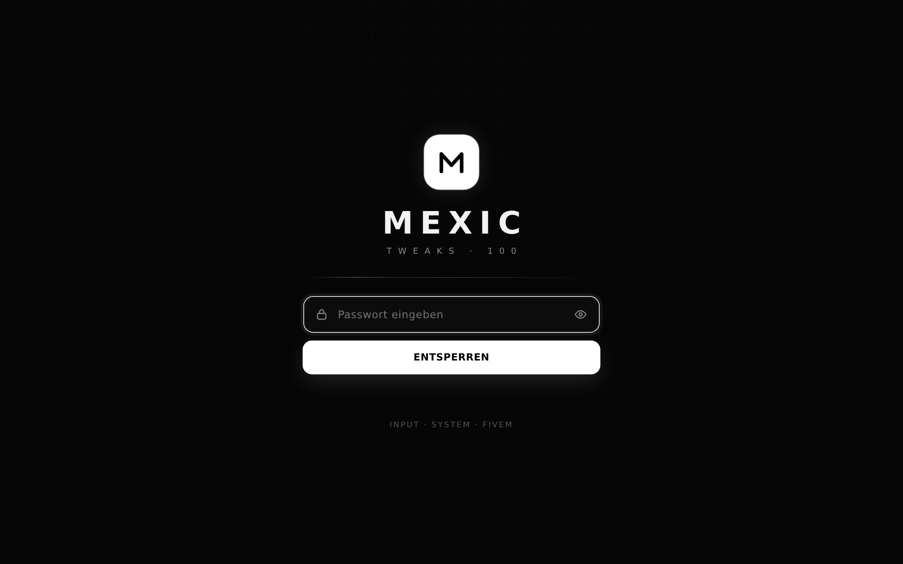
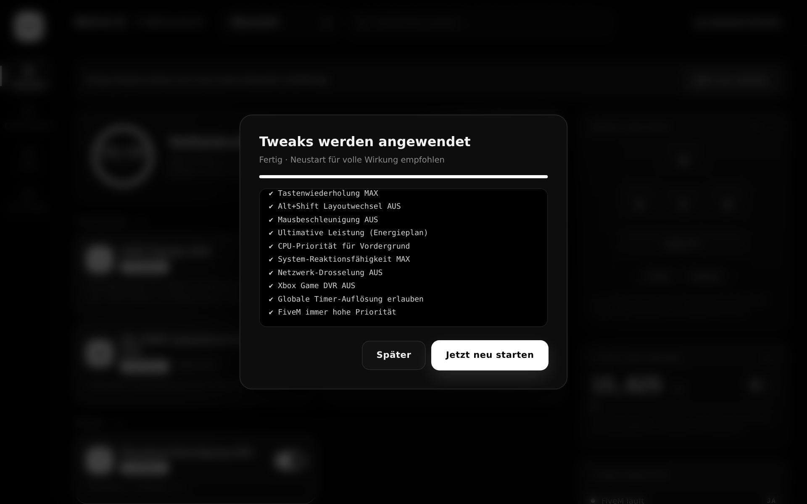
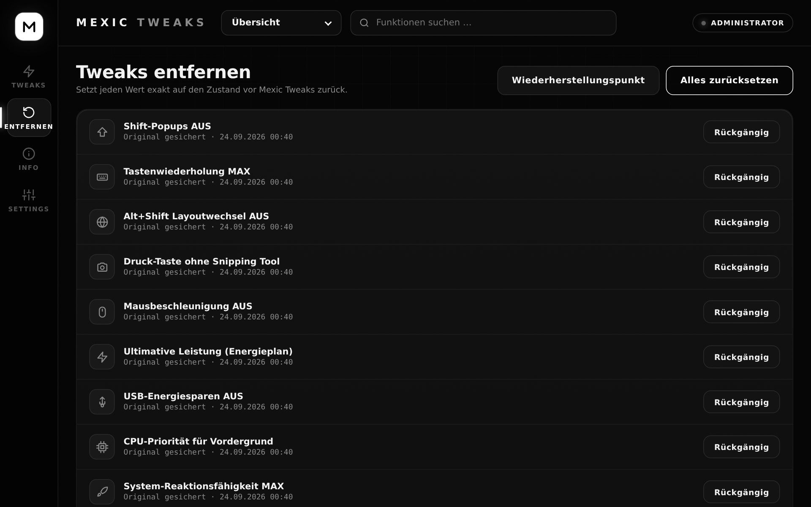

<div align="center">


# MEXIC TWEAKS

**Input-, System- & FiveM-Optimierung für Windows 10/11, mit einem Klick und voll reversibel.**


[**⬇ Download**](../../releases/latest) · [Features](#-features) · [Installation](#-installation) · [Rückgängig machen](#-rückgängig-machen) · [FAQ](#-faq)


</div>

---

## ✦ Features

| | |
|---|---|
| **15 Tweaks** | Tastatur, Maus, System und FiveM, jeder einzeln an- und ausschaltbar |
| **Alle anwenden** | Ein Klick, optional mit Windows-Wiederherstellungspunkt vorher |
| **Automatisches Backup** | Originalwerte werden vor jeder Änderung gesichert |
| **1:1 Rückgängig** | Einzeln oder alles auf einmal, exakt auf den vorherigen Zustand |
| **WASD Live-Test** | Zeigt W/A/S/D/Shift/Ctrl/Space in Echtzeit, auch wenn FiveM im Vordergrund ist |
| **Timer 0,5 ms** | Windows-Timer-Auflösung per Schalter von 15,6 ms auf 0,5 ms |
| **FiveM Booster** | Erkennt laufendes FiveM und setzt es auf CPU-Priorität „Hoch“ |
| **System-Check** | Prüft live die echten Windows-Werte |
| **Passwortschutz** | Zugang nur mit Passwort |

### Tweaks im Überblick

| Kategorie | Tweak | Wirkung |
|---|---|---|
| ⌨ Tastatur | Shift-Popups AUS (Einrastfunktion / Anschlagverzögerung) | **Spürbar** |
| ⌨ Tastatur | Alt+Shift Layoutwechsel AUS | **Spürbar** |
| ⌨ Tastatur | Tastenwiederholung MAX | Komfort |
| ⌨ Tastatur | Druck-Taste ohne Snipping Tool | Komfort |
| 🖱 Maus | Mausbeschleunigung AUS | **Spürbar** |
| ⚙ System | Ultimative Leistung (Energieplan) | Leicht |
| ⚙ System | USB-Energiesparen AUS | Leicht |
| ⚙ System | CPU-Priorität für Vordergrund | Leicht |
| ⚙ System | System-Reaktionsfähigkeit MAX | Leicht |
| ⚙ System | Spiele-Priorität ULTRA | Leicht |
| ⚙ System | Netzwerk-Drosselung AUS | Leicht |
| ⚙ System | Xbox Game DVR AUS | **Spürbar** |
| ⚙ System | Windows-Spielmodus AN | Leicht |
| ⚙ System | Globale Timer-Auflösung erlauben | Leicht |
| 🚗 FiveM | FiveM immer hohe Priorität | **Spürbar** |

➜ Welche Registry-Werte genau geändert werden: **[docs/TWEAKS.md](docs/TWEAKS.md)**

---

## ⬇ Installation

1. Unter [**Releases**](../../releases/latest) die Datei **`MexxicTweak100.exe`** herunterladen.
2. Doppelklick → **„Ja“** bei der Administrator-Abfrage.
   > Falls Windows *„Der Computer wurde durch Windows geschützt“* anzeigt:
   > **Weitere Informationen → Trotzdem ausführen** (die EXE ist nicht signiert).
3. Passwort eingeben → **Entsperren**.
4. **Alle anwenden** klicken (Wiederherstellungspunkt-Haken drin lassen) → PC neu starten.

**Voraussetzungen:** Windows 10 oder 11 (64-bit) und die Microsoft Edge WebView2 Runtime. Die ist bei Windows 11 und aktuellem Windows 10 schon dabei. Falls sie fehlt, zeigt die App einen Download-Link.

<p align="center">
  
  
</p>

---

## ↺ Rückgängig machen

Mexic Tweaks sichert vor jeder Änderung die Originalwerte in
`%APPDATA%\MexxicTweaks\backup.json`.

- **In der App:** Tab **Entfernen** → einzelne Tweaks mit *Rückgängig* oder **Alles zurücksetzen**.
- **Notfall:** `Win + R` → `rstrui` → Wiederherstellungspunkt **„Mexic Tweaks“** auswählen.

<p align="center"></p>

---

## ? FAQ

<details>
<summary><b>Merke ich wirklich einen Unterschied?</b></summary>

Am deutlichsten bei **Mausbeschleunigung aus**: das Aiming wird konstanter. Außerdem hören die Shift-Popups und der Alt+Shift-Layoutwechsel auf, Game DVR fällt weg und FiveM bekommt mehr CPU-Priorität. Die System-Tweaks sind messbar, aber subtil. Am meisten bringen sie, wenn viel im Hintergrund läuft.
</details>

<details>
<summary><b>Macht das meine Tastatur schneller?</b></summary>

Die Hardware nicht: Die Reaktionszeit bestimmt die Polling-Rate deiner Tastatur. Mexic Tweaks räumt aber alles aus dem Weg, was Windows zwischen dich und das Spiel stellt.
</details>

<details>
<summary><b>Ist das sicher für FiveM / Anti-Cheat?</b></summary>

Ja. Es werden nur Windows-Einstellungen geändert. Keine Makros, keine Eingriffe in FiveM- oder GTA-Dateien, keine Injection.
</details>

<details>
<summary><b>Mein Antivirus meldet die EXE.</b></summary>

Die EXE ist nicht signiert und ändert Systemeinstellungen, deshalb warnen manche Scanner. Der komplette Quellcode liegt in <a href="src/"><code>src/</code></a>, du kannst ihn prüfen und selbst bauen.
</details>

<details>
<summary><b>Wo werden Daten gespeichert?</b></summary>

Nur lokal: <code>%APPDATA%\MexxicTweaks\</code> (Backup) und <code>%LOCALAPPDATA%\MexxicTweaks\</code> (UI-Cache). Es wird nichts ins Internet gesendet.
</details>

---

## 🧰 Extras

| Datei | Beschreibung |
|---|---|
| [`extras/Registry-Backup.bat`](extras/Registry-Backup.bat) | Komplettes Registry-Backup (alle Hives als .reg) in einen Ordner deiner Wahl, plus Wiederherstellungspunkt |

---

## 🛠 Selbst bauen

```bat
:: Go 1.22+ installieren: https://go.dev/dl/
cd src
build.bat
```

Die fertige `MexxicTweak100.exe` landet im Hauptordner. Aufbau des Quellcodes:

```
src/
├─ main.go            App-Start, Login, Backup, Jobs, UI-Bindings
├─ tweaks.go          Alle Tweaks (Anwenden / Rückgängig / Prüfen)
├─ sys_windows.go     Windows-API & Registry-Helfer
├─ ui.html            Komplette Oberfläche (HTML/CSS/JS, wird eingebettet)
├─ icon.png           App-Icon
├─ rsrc_windows_amd64.syso   Icon + Admin-Manifest
├─ build.bat / build.sh
└─ go.mod
```

---

<div align="center">
<sub>MEXIC TWEAKS · Nutzung auf eigene Verantwortung · Alle Änderungen sind über die App rückgängig zu machen.</sub>
</div>
