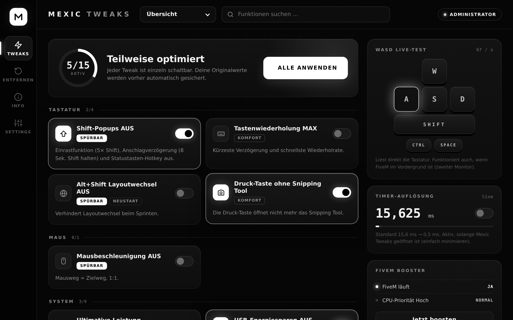
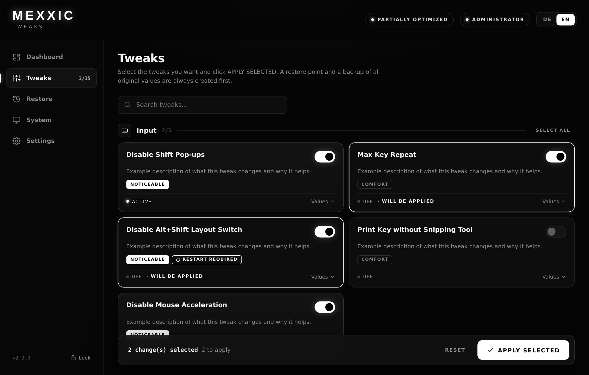
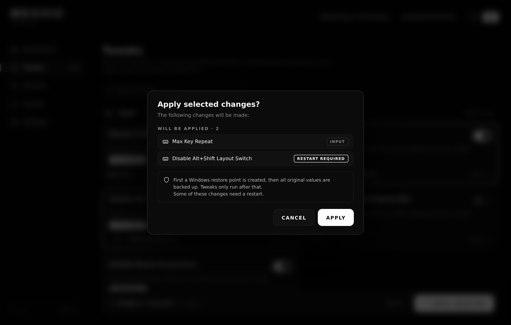
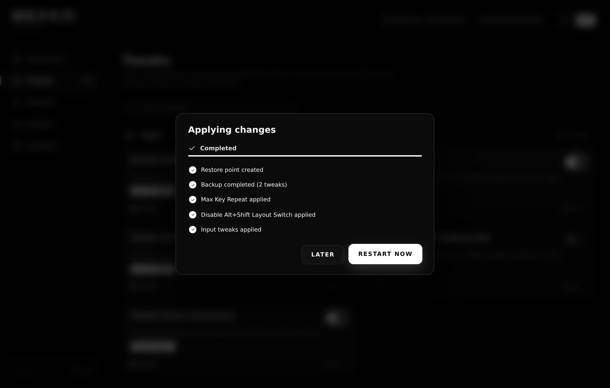
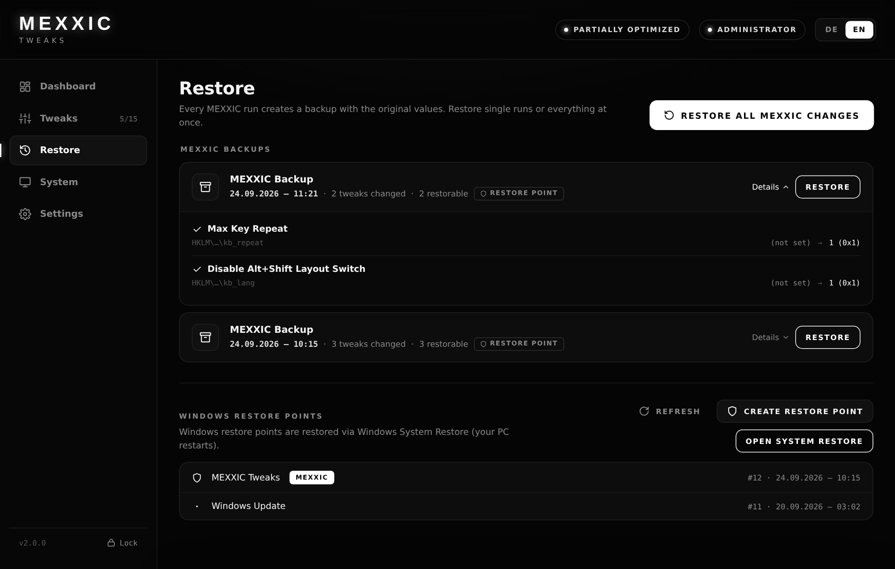

<div align="center">


# MEXXIC Tweaks

**Input-, Netzwerk-, Windows-, Gaming- & FiveM-Optimierung für Windows 10/11.**
Minimalistisch. Schwarz. Weiß. Schnell. Übersichtlich. Rücksetzbar.


[**⬇ Download**](../../releases/latest) · [Features](#-features) · [Sicherheit](#-sicherheit--backup) · [Restore](#-restore) · [FAQ](#-faq)



</div>

---

## ✦ Features

| | |
|---|---|
| **15 Tweaks in 5 Kategorien** | Input · Network · Windows · Gaming · FiveM, jeder einzeln wählbar |
| **APPLY SELECTED** | Auswahl sammeln, vor dem Anwenden noch einmal alles anzeigen lassen |
| **Pflicht-Sicherung** | Windows-Wiederherstellungspunkt **und** MEXXIC-Backup vor jeder Änderung |
| **Echte Prüfung** | Nach jedem Tweak wird der echte Windows-Wert geprüft. Nichts wird als erfolgreich gemeldet, was nicht wirklich gesetzt ist |
| **Restore-Seite** | Jede Sicherung mit Datum, Anzahl, Original → Neu-Werten. Einzeln oder alles zurücksetzen |
| **Live-Status** | ✓ Restore point created · ✓ Backup completed · ✓ Input tweaks applied · ✕ Failed … |
| **Dashboard** | Aktive Tweaks, letztes Backup, Restore verfügbar, Status, Kategorien, letzte Aktivität |
| **System-Seite** | Hardware-Info, Timer 0,5 ms, FiveM Booster, WASD-Live-Test |
| **Deutsch / English** | Sprache jederzeit umschaltbar (Login & Settings) |
| **Passwortschutz** | Zugang nur mit Passwort, nicht im Klartext gespeichert |

<p align="center">
  
  
</p>

### Tweaks

| Kategorie | Tweak | Wirkung | Admin | Neustart |
|---|---|---|:-:|:-:|
| Input | Shift-Popups aus (Einrastfunktion, Anschlagverzögerung, Statustasten) | **Spürbar** | | |
| Input | Tastenwiederholung MAX | Komfort | | |
| Input | Alt+Shift-Layoutwechsel aus | **Spürbar** | | ✓ |
| Input | Druck-Taste ohne Snipping Tool | Komfort | | |
| Input | Mausbeschleunigung aus | **Spürbar** | | |
| Network | Netzwerk-Drosselung aus | Leicht | ✓ | ✓ |
| Windows | Energieplan „MEXXIC Ultimate“ | Leicht | ✓ | |
| Windows | USB-Energiesparen aus | Leicht | ✓ | |
| Windows | CPU-Priorität für Vordergrund | Leicht | ✓ | |
| Windows | System-Reaktionsfähigkeit MAX | Leicht | ✓ | |
| Windows | Globale Timer-Auflösung erlauben | Leicht | ✓ | ✓ |
| Gaming | Spiele-Priorität ULTRA | Leicht | ✓ | |
| Gaming | Xbox Game DVR aus | **Spürbar** | ✓ | |
| Gaming | Windows-Spielmodus an | Leicht | | |
| FiveM | FiveM immer hohe Priorität | **Spürbar** | ✓ | |

Welche Registry-Werte genau geändert werden, steht in **[docs/TWEAKS.md](docs/TWEAKS.md)**. Es werden keine Windows-Sicherheitsfunktionen deaktiviert.

---

## ⬇ Installation

1. Unter [**Releases**](../../releases/latest) die Datei **`MexxicTweak100.exe`** herunterladen.
2. Doppelklick → **Ja** bei der Administrator-Abfrage.
   > Zeigt Windows *„Der Computer wurde durch Windows geschützt“*: **Weitere Informationen → Trotzdem ausführen** (die EXE ist nicht signiert).
3. Passwort eingeben → **LOGIN** (oder Enter).
4. **Tweaks** → gewünschte Tweaks anschalten → **APPLY SELECTED** → Liste prüfen → **Apply**.

**Voraussetzungen:** Windows 10/11 64-bit und die Microsoft Edge WebView2 Runtime. Die ist bei Windows 11 und aktuellem Windows 10 schon dabei.

---

## 🛡 Sicherheit & Backup

Jeder Durchlauf läuft immer in dieser Reihenfolge ab:

1. **Windows-Wiederherstellungspunkt** wird erstellt.
   Schlägt das fehl, etwa weil der Computerschutz aus ist, erscheint eine klare Warnung. Es geht nur weiter, wenn du **ausdrücklich** bestätigst.
2. **MEXXIC-Backup:** Alle Originalwerte werden gesichert, auf die Festplatte geschrieben und geprüft.
   Schlägt das fehl, wird **nichts** geändert.
3. **Tweaks** werden angewendet. Jeder wird danach gegen den echten Windows-Wert geprüft.
4. **Status** pro Tweak und pro Kategorie (✓ / ✕). Tweaks, die einen Neustart brauchen, sind mit **Restart required** markiert.

Für jeden Tweak wird gespeichert: **was** geändert wurde, der **Originalwert**, der **neue Wert** und **wann**.
Datei: `%APPDATA%\MexxicTweaks\backup.json`

<p align="center"></p>

---

## ↺ Restore

- **Restore → MEXXIC Backups:** jede Sicherung mit Datum, Anzahl der Tweaks und allen Werten (Original → Neu). **RESTORE** setzt genau diese Sicherung zurück.
- **RESTORE ALL MEXXIC CHANGES** setzt alles auf die Originalwerte zurück.
- **Windows Restore Points:** Liste der Wiederherstellungspunkte und ein Button zur Windows-Systemwiederherstellung.
- Vor jedem Restore kommt die Sicherheitsabfrage *„Are you sure you want to restore these changes?“*.

<p align="center"></p>

---

## ? FAQ

<details><summary><b>Merke ich wirklich einen Unterschied?</b></summary>

Am deutlichsten bei <b>Mausbeschleunigung aus</b> (konstanteres Aiming). Außerdem hören die Shift-Popups und der Alt+Shift-Layoutwechsel auf, Game DVR fällt weg und FiveM bekommt eine höhere Priorität. Die Windows-Tweaks sind messbar, aber subtil.
</details>

<details><summary><b>Ist das sicher für FiveM / Anti-Cheat?</b></summary>

Es werden nur Windows-Einstellungen geändert. Keine Makros, keine Eingriffe in FiveM- oder GTA-Dateien, keine Injection.
</details>

<details><summary><b>Mein Antivirus meldet die EXE.</b></summary>

Die EXE ist nicht signiert und ändert Systemeinstellungen. Der komplette Quellcode liegt in <a href="src/"><code>src/</code></a>.
</details>

<details><summary><b>Wo werden Daten gespeichert?</b></summary>

Nur lokal in <code>%APPDATA%\MexxicTweaks\</code> (Backup, Einstellungen, Aktivität). Es wird nichts ins Internet gesendet.
</details>

---

## 🛠 Selbst bauen

```bat
:: Go 1.22+ installieren: https://go.dev/dl/
cd src
build.bat
```

```
src/
├─ main.go              Start, Fenster
├─ icon.ico             App-Icon (16–256 px, eingebettet über rsrc_windows_amd64.syso)
├─ ui_bridge.go         UI ↔ Services
├─ ui/index.html        Oberfläche (HTML/CSS/JS, DE/EN, wird eingebettet)
├─ job_service.go       Services: Restore Point → Backup → Apply/Restore → Prüfung
├─ app_state.go         Services: Einstellungen, Login, Aktivität, Neustart, Systeminfo
├─ backup_store.go      Backup: Originalwerte + Sicherungen (backup.json)
├─ restore_service.go   Restore: Windows-Wiederherstellungspunkte
├─ tweak.go             Tweaks: Tweak-Typ (Apply / Restore / Active / State)
├─ tweaks_input.go      Input-Tweaks
├─ tweaks_network.go    Network-Tweaks
├─ tweaks_windows.go    Windows-Tweaks
├─ tweaks_gaming.go     Gaming-Tweaks
├─ tweaks_fivem.go      FiveM-Tweaks
├─ models.go            Models
├─ util_winapi.go       Utilities: Windows-API
└─ util_registry.go     Utilities: Registry
```

**Neuen Tweak hinzufügen:** in der passenden `tweaks_<kategorie>.go` einen weiteren Eintrag anlegen (Name/Beschreibung auf EN + DE, Registry-Werte oder Apply/Restore/Check). Backup, Restore, Prüfung und UI übernehmen ihn automatisch.

---

## 🧰 Extras

| Datei | Beschreibung |
|---|---|
| [`extras/Registry-Backup.bat`](extras/Registry-Backup.bat) | Komplettes Registry-Backup (alle Hives) in einen Ordner deiner Wahl |

<div align="center"><sub>MEXXIC Tweaks · Nutzung auf eigene Verantwortung · Alle Änderungen sind über die Restore-Seite rückgängig zu machen.</sub></div>
